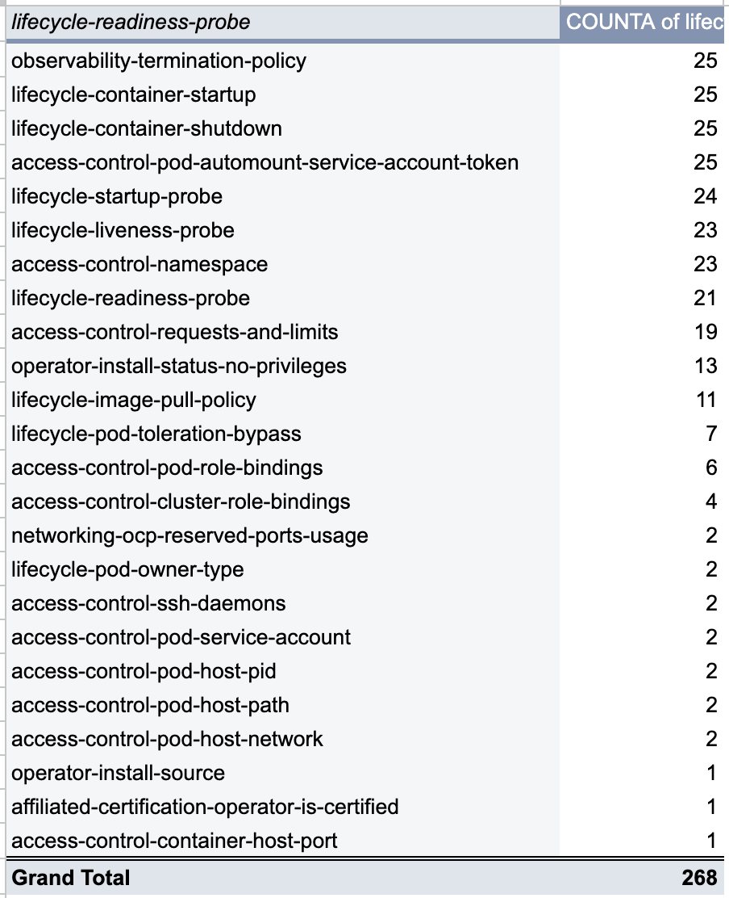

// Settings:
:description: The article CNF Certification Test failures.
:doctype: book
:pdf-page-size: A4
:toc: macro
:!toc-title:

// Valiables
:ocp-version: 4.13
// URLs:
:url-best-cnf: https://test-network-function.github.io/cnf-best-practices
:url-best-operator: https://github.com/operator-framework/community-operators/blob/master/docs/best-practices.md
:url-catalog: https://github.com/test-network-function/cnf-certification-test/blob/main/CATALOG.md
:url-cnf-cert: https://github.com/test-network-function/cnf-certification-test
:url-operators: https://docs.google.com/spreadsheets/d/1E_Xafj_QGjDondIXj6bi0qCU0KQiOIRbJICPYHnZd2s
:url-report: https://docs.google.com/spreadsheets/d/1mYs8fpeBTmN4Mnnr1XOl0VxBO2pTQbjqo6rXlTVvpIs
:url-slack: https://redhat-internal.slack.com/archives/C05PKB9TT5G
:url-tainted: https://github.com/test-network-function/cnf-certification-test/blob/main/CATALOG.md#platform-alteration-tainted-node-kernel
:url-tainted-nft: https://issues.redhat.com/browse/OCPBUGS-13330
:url-tainted-tp: https://github.com/rdavid/docs/blob/master/tainted-kernel-tech-preview.adoc

= CNF Certification Test failures

toc::[]

.Revision History
[%autowidth]
|===
| Version | Date | Who | Changes
| 1.0 | September 7, 2023 | David Rabkin | Initial Version
| 1.1 | December 5, 2023 | David Rabkin | Updated results
|===

.Terminology
[%autowidth]
|===
| Acronym | Meaning
| CNF | Containerized Network Function
| OCP | OpenShift Container Platform
| RHCOS | Red Hat Enterprise Linux CoreOS operating system
| RHEL | Red Hat Enterprise Linux operating system
|===

== Overview

A major part of Telco partner certification is
{url-cnf-cert}[CNF Certification Test].
These test cases are specifically designed to verify whether the deployment of
the Telco partner's solution on Red Hat OpenShift follows the
{url-best-cnf}[CNF Best Practices] and the
{url-best-operator}[Operator Best Practices].
By conducting these tests, we ensure that the implementation aligns with the
recommended standards and guidelines for optimal performance and compatibility.

In the suite, there are {url-catalog}[88 test cases], consisting of both
mandatory and optional cases.
These cases are divided among nine different suites.

== Operators

We conducted the {url-cnf-cert}[CNF Certification Test] on over two hundred of
{url-operators}[Red Hat's operators] on OCP {ocp-version}.
Consequently, we have detected an average of approximately thirty failures per
operator.
For additional details, please refer to the {url-report}[CNF Report for
Operators - 20231120].
You can use the operator name filter to narrow down your search.

== Failures

The failures are categorized by operators in the {url-report}[CNF Report for
Operators - 20231120].
The report enables the filtering of failures based on specific operators.

The first priority should be addressing the most commonly required mandatory
tests, see the frequencies tab in the report.

== Known Issues

A known bug exists in OCP 4.12, specifically within RHCOS 8.6, causing
{url-tainted}[`platform-alteration-tainted-node-kernel`] failures on one or
more master nodes.
Further details can be found in the {url-tainted-tp}[Tainted Kernel Tech
Preview].
There is another {url-tainted-nft}[known bug] present in OCP 4.13.
We should differentiate between taints originating from our side (ideally none)
and those arising from the CNF under test.
