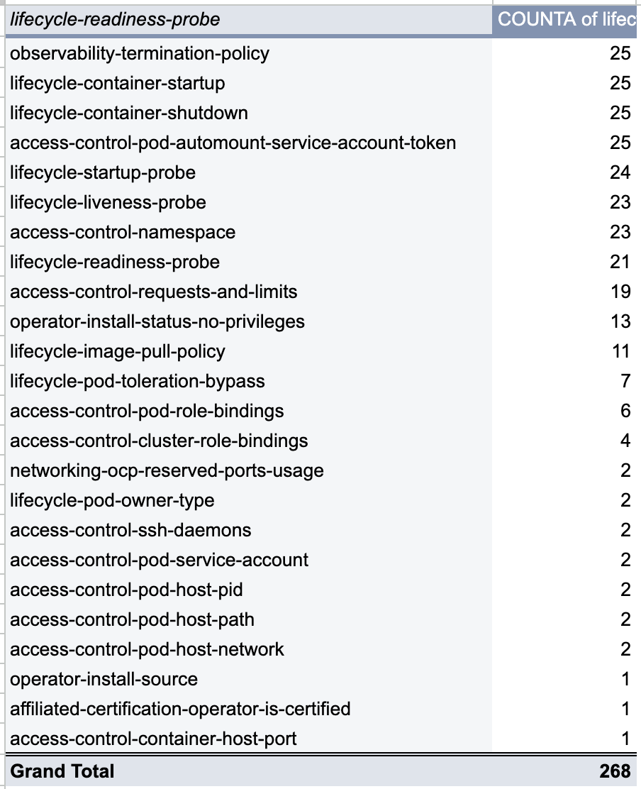

// Settings:
:description: The article CNF Certification Test failures.
:doctype: book
:pdf-page-size: A4
:toc: macro
:!toc-title:

// Variables
:ocp-version: 4.13
// URLs:
:url-best-cnf: https://test-network-function.github.io/cnf-best-practices
:url-best-operator: https://github.com/operator-framework/community-operators/blob/master/docs/best-practices.md
:url-catalog: https://github.com/test-network-function/cnf-certification-test/blob/main/CATALOG.md
:url-cnf-cert: https://github.com/test-network-function/cnf-certification-test
:url-operators: https://docs.google.com/spreadsheets/d/1E_Xafj_QGjDondIXj6bi0qCU0KQiOIRbJICPYHnZd2s
:url-report: https://docs.google.com/spreadsheets/d/1mYs8fpeBTmN4Mnnr1XOl0VxBO2pTQbjqo6rXlTVvpIs
:url-slack: https://redhat-internal.slack.com/archives/C05PKB9TT5G
:url-tainted: https://github.com/test-network-function/cnf-certification-test/blob/main/CATALOG.md#platform-alteration-tainted-node-kernel
:url-tainted-nft: https://issues.redhat.com/browse/OCPBUGS-13330
:url-tainted-tp: https://github.com/rdavid/docs/blob/master/tainted-kernel-tech-preview.adoc

= CNF Certification Test failures

toc::[]

.Revision History
[%autowidth]
|===
| Version | Date | Who | Changes
| 1.0 | September 7, 2023 | David Rabkin | Initial Version
| 1.1 | December 5, 2023 | David Rabkin | Updated results
| 1.2 | June 19, 2026 | David Rabkin | Improved wording
|===

.Terminology
[%autowidth]
|===
| Acronym | Meaning
| CNF | Containerized Network Function
| OCP | OpenShift Container Platform
| RHCOS | Red Hat Enterprise Linux CoreOS operating system
| RHEL | Red Hat Enterprise Linux operating system
|===

== Overview

A major part of Telco partner certification is
{url-cnf-cert}[CNF Certification Test].
These test cases verify that the Telco partner's solution, deployed on Red Hat
OpenShift, follows the {url-best-cnf}[CNF Best Practices] and the
{url-best-operator}[Operator Best Practices].
The tests confirm that the implementation meets the recommended standards for
performance and compatibility.

The suite holds {url-catalog}[88 test cases], both mandatory and optional,
split across nine suites.

== Operators

We ran the {url-cnf-cert}[CNF Certification Test] on over two hundred
{url-operators}[Red Hat operators] on OCP {ocp-version} and found an average of
thirty failures per operator.
For details, see the {url-report}[CNF Report for Operators - 20231120], where
the operator-name filter narrows the search.

== Failures

The {url-report}[CNF Report for Operators - 20231120] groups the failures by
operator and lets you filter them per operator.

Address the most common mandatory tests first; see the frequencies tab in the
report.

== Known Issues

A known bug in OCP 4.12, within RHCOS 8.6, causes
{url-tainted}[`platform-alteration-tainted-node-kernel`] failures on one or
more master nodes.
The {url-tainted-tp}[Tainted Kernel Tech Preview] covers the details.
OCP 4.13 carries another {url-tainted-nft}[known bug].
We should distinguish taints that originate on our side (ideally none) from
those the CNF under test introduces.
